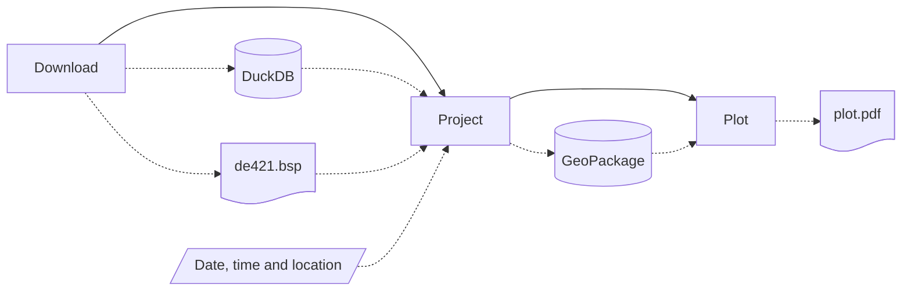

# Star Chart


A simple set of CLI tools designed to automatically download, parse, project and plot astronomical observation data for star chart authoring.

## Installation

To install this tool and all of its dependencies in a virtual environment, run:

```
uv sync
```

## Usage

This package is composed of multiple CLI tools designed to be chained in a star chart authoring pipeline in the following order:



Below, you will find documentation for each tool. Also, feel free to call `star-chart plot --help` for interactive help.

### `download` Tool

Automatically download, sanitize, and organize astronomical observation data from [VizieR](https://vizier.cds.unistra.fr/) and [Stellarium](https://github.com/Stellarium) into a DuckDB database file containing the following tables: `stars`, `constellation_boundaries` and `constellation_edges`. Ephemeris data from NASA's JPL will also be downloaded into a BSP file.

```sh
star-chart download [OUTPUT_DATABASE_FILE_PATH] [OUTPUT_EPHEMERIS_FILE_PATH]
```

Where:


- `[OUTPUT_DATABASE_FILE_PATH]`
    
    Output DuckDB database file path (defaults to `./output/download.duckdb`).

- `[OUTPUT_EPHEMERIS_FILE_PATH]`
    
    Output ephemeris file path (defaults to `./output/de421.bsp`).

As an example, to download astronomical observation data to a DuckDB database at `./output/download.duckdb` and ephemeris data from NASA's JPL to a BSP file at `./output/de421.bsp`, you can run:

```sh
star-chart download "./output/download.duckdb" "./output/de421.bsp"
```

Again, feel free to call `star-chart download --help` for help.