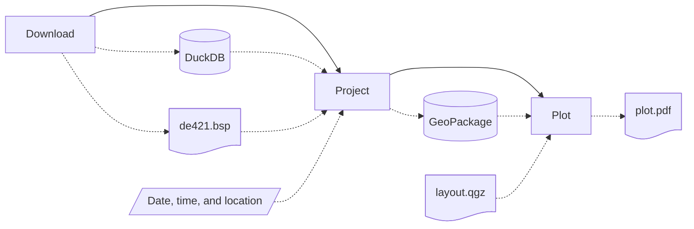

# Star Chart


A simple set of CLI tools designed to automatically download, parse, project, and plot astronomical observation data for star chart authoring.

## Installation

To install this tool and all of its dependencies in a virtual environment, run:

```sh
uv sync
```

## Usage

This package is composed of multiple CLI tools designed to be chained in a star chart authoring pipeline in the following order:



Below, you will find documentation for each tool. You can also call `star-chart --help` for interactive help.

### `download` Tool

Automatically downloads, sanitizes, and organizes astronomical observation data from [VizieR](https://vizier.cds.unistra.fr/) and [Stellarium](https://github.com/Stellarium) into a DuckDB database file containing the following tables: `stars`, `constellation_boundaries`, and `constellation_edges`. Ephemeris data from NASA's JPL will also be downloaded into a BSP file.

```text
star-chart download [OUTPUT_DATABASE_FILE_PATH] [OUTPUT_EPHEMERIS_FILE_PATH]
```

Where:

- `[OUTPUT_DATABASE_FILE_PATH]`
    
    Output DuckDB database file path (defaults to `./output/download.duckdb`).

- `[OUTPUT_EPHEMERIS_FILE_PATH]`
    
    Output ephemeris data file path (defaults to `./output/de421.bsp`).

As an example, to download astronomical observation data to a DuckDB database at `./output/download.duckdb` and ephemeris data from NASA's JPL to a BSP file at `./output/de421.bsp`, you can run:

```sh
star-chart download "./output/download.duckdb" "./output/de421.bsp"
```

For more information, call `star-chart download --help`.

### `observe` Tool

Observes and projects astronomical data for a given date, time, and location (latitude, longitude) into a GeoPackage file containing the following feature classes: `stars` (points), `constellation_boundaries` (polygons), and `constellation_edges` (lines). The date and time arguments should be provided in UTC.

```text
star-chart observe  INPUT_DATE:[%Y-%m-%d|%Y-%m-%dT%H:%M:%S|%Y-%m-%d%H:%M:%S]
                    INPUT_LATITUDE
                    INPUT_LONGITUDE
                    [INPUT_DATABASE_FILE_PATH]
                    [INPUT_EPHEMERIS_FILE_PATH]
                    [OUTPUT_GEOPACKAGE_FILE_PATH]
```

Where:

- `INPUT_DATE`
    
    Date and time of the observation in UTC.

- `INPUT_LATITUDE`
    
    Latitude of the observation in decimal degrees.

- `INPUT_LONGITUDE`
    
    Longitude of the observation in decimal degrees.

- `[INPUT_DATABASE_FILE_PATH]`
    
    Input DuckDB database file path as generated by the `download` tool (defaults to `./output/download.duckdb`).

- `[INPUT_EPHEMERIS_FILE_PATH]`
    
    Input ephemeris data file path as generated by the `download` tool (defaults to `./output/de421.bsp`).

- `[OUTPUT_GEOPACKAGE_FILE_PATH]`
    
    Output GeoPackage file path (defaults to `./output/observe.gpkg`).

As an example, to project an astronomical observation of the sky for 2023-06-04T02:00:00, located at -21.232989, -44.998945, into a GeoPackage file at `./output/observe.gpkg`, you can run:

```sh
star-chart observe -- 2023-06-04T02:00:00 -21.232989 -44.998945 "./output/download.duckdb" "./output/de421.bsp" "./output/observe.gpkg"
```

For more information, call `star-chart observe --help`.